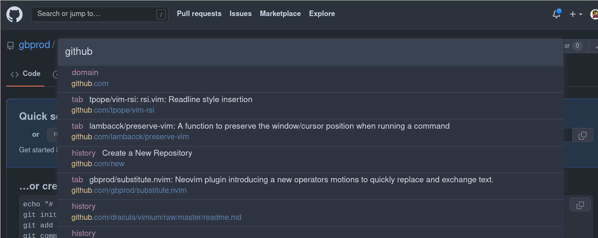

# Nord theme for [Vimium](https://vimium.github.io/)

## 📦 Installation

### Install the browser extension

- [Chrome](https://chrome.google.com/webstore/detail/vimium/dbepggeogbaibhgnhhndojpepiihcmeb)
- [Firefox](https://addons.mozilla.org/en-US/firefox/addon/vimium-ff/)

### Activating theme

1. Go into the Vimium addon's preferences.
1. Activate _advanced options_.
1. Now copy the content of [`vimium-nord.css`](https://raw.githubusercontent.com/gbprod/vimium-nord-theme/master/vimium-nord.css) into the custom CSS field. Done!

## 🎉 Credits

- [dracula/vimium](https://github.com/dracula/vimium/)
